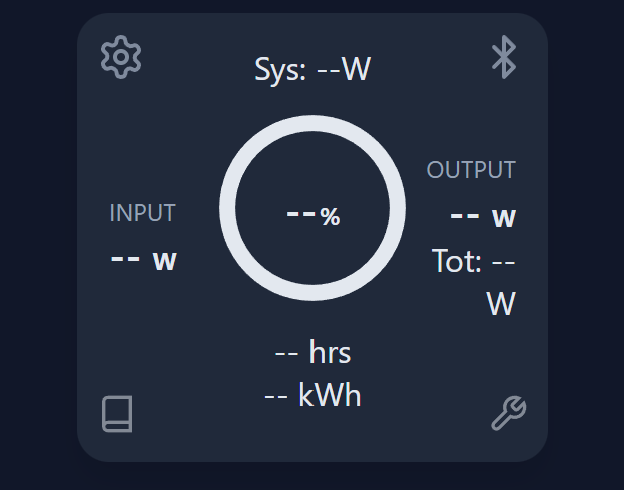

# Fossibot F2400 / F3600 Pro Control PWA

**Unlock the full potential of your Fossibot power station.**

This Progressive Web App (PWA) allows you to control and monitor your Fossibot F2400, F3600 Pro, and similar power stations directly from your browser via Bluetooth Low Energy (BLE). It bypasses the need for the official cloud-dependent app, offering a private, offline-first, and feature-rich alternative.

**🚀 [Launch Web App](https://dandwhelan.github.io/fossibot-bluetooth/)**

### 📱 Interface Guide

| Area | Icon / Label | Function |
| :--- | :--- | :--- |
| **Top Left** | ⚙️ (Gear) | **Settings:** Open configuration menu (Charge limits, Timers, Theme). |
| **Top Right** | ⚡ (Bluetooth) | **Connect/Disconnect:** Toggle connection to the device. |
| **Center** | **Ring Chart** | **Battery Level:** Visual and percentage SOC. Color changes with level. |
| **Center** | **-- W** | **Power Flow:** Input (Left) and Output (Right) wattage. |
| **Bottom** | **-- hrs** | **Time Remaining:** Shows "Time to Empty" 🔋 or "Time to Full" ⚡ while charging. |
| **Bottom Left** | 📖 (Book) | **Device Info:** System Summary and status flags. |
| **Bottom Right** | 🔧 (Wrench) | **Diagnostics:** Advanced debugging, register inspector, and JSON import/export. |

## ✨ Comprehensive Features

### ⚡ Real-Time Telemetry & Monitoring
*   **Smart Time Estimates:** Automatically switches between **"Time to Full"** (⚡) when charging and **"Time to Empty"** (🔋) when discharging.
*   **Live Power Flow:** Visualize real-time Input (Charging) and Output (Discharging) wattage with dynamic gauges.
*   **System Health:** Monitor system voltage, frequency, and internal temperatures (fan levels).
*   **Battery Extensions:** Support for monitoring external battery packs (Success/Extension batteries) with individual charge levels.

### 🔋 Power Simulator
*   **Runtime Calculator:** Estimate how long your power station will run with selected appliances.
*   **Split AC/DC Lists:** Clearly organized appliance management with separate AC and DC columns.
*   **Editable Wattages:** Click any appliance wattage to customize its power draw.
*   **Efficiency Modeling:** Card-based AC (88%) and DC (96%) efficiency toggles to account for real-world conversion losses.
*   **Custom Appliances:** Add your own devices with custom names, wattages, and AC/DC type.

### 🛠️ Advanced Control Dashboard
*   **Power Toggle:** Remotely toggle AC Inverter, DC (12V) Output, and USB Ports.
*   **LED Light Control:** Switch between Light modes: **Off**, **Low**, **High**, **SOS**, and **Flash**.
*   **Silent Charging Mode:** Toggle "Silent Charging" to reduce fan noise max charging speed for overnight use.

### ⚙️ Power Management Settings
*   **Accordion Layout:** Clean collapsible sections for Quick Actions, Power Limits, Timers, and Theme selection.
*   **Charging Rate:** Adjust AC Charging power from **200W to 1100W+** (Verify supported limits for your specific model).
*   **Discharge Limit:** Set a lower limit for battery discharge (e.g., stop discharging at 10%) to preserve battery health.
*   **EPS / UPS Settings:** Configure Entry Power Supply (UPS mode) behavior and upper charge limits.
*   **Standby Timers:** detailed control over auto-shutdown timers to save power:
    *   **Screen Timeout:** 1 min, 5 min, Never.
    *   **System Standby:** Auto-shutdown after inactivity.
    *   **AC Standby:** Turn off inverter if no load detected.
    *   **DC/USB Standby:** Turn off low-voltage ports if idle.

### 🔍 Advanced Diagnostics & Reverse Engineering
*   **Auto-Refresh:** Live status updates every 2-10 seconds for real-time debugging.
*   **Multi-Device Comparison:** Import JSON diagnostic files from other users to compare specifications, firmware settings, and calibration data side-by-side.
*   **Change Recorder:** Capture a baseline and automatically detect register changes after performing physical actions on the device (reverse engineering helper).
*   **Register Inspector:** View raw BMS data streams (0x1104 Status vs 0x1103 Settings).
*   **System Summary:** Get a plain-English status report of the device state.
*   **Visualization:** "Flash" indicators show exactly which data points are changing in real-time.
*   **Hide Zeros:** Filter out unused registers to focus on active data.

### 🎨 Customization & Themes
Personalize your control panel with built-in themes:
*   ☢️ **Pipboy:** Fallout-inspired retro CRT green.
*   🏭 **Industrial:** Clean, high-contrast, professional amber/slate look.
*   🌃 **Cyberpunk:** Neon magenta and cyan on dark purple.
*   🌊 **Ocean:** Calming teal and deep blue tones. (Default)
*   🌅 **Sunset:** Warm gradients of violet, orange, and gold.
*   ☀️ **Daylight:** Pleasant light mode with soft whites and muted blues.
*   🖥️ **Terminal:** Minimalist retro command prompt style.
*   🌈 **Rainbow:** High-visibility vibrant colors.

---

## 📱 detailed Installation Guide

This app uses **Web Bluetooth API**, which means it runs entirely in your browser but can talk to hardware devices.

### Platform Support

| Platform | Browser | Status | Notes |
| :--- | :--- | :--- | :--- |
| **Android** | Chrome / Edge | ✅ Fully Supported | Best experience. Supports PWA install. |
| **Windows / Mac / Linux** | Chrome / Edge | ✅ Fully Supported | Requires Bluetooth hardware on PC. |
| **iOS / iPadOS** | **Bluefy** Browser | ⚠️ Restricted | Safari does NOT support Web Bluetooth. You must download [Bluefy](https://apps.apple.com/us/app/bluefy-web-ble-browser/id1492822055) from the App Store. |

### How to Install (PWA)
For the best experience (fullscreen, offline access), install the app:

1.  **Open the App:** Navigate to [dandwhelan.github.io/fossibot-bluetooth/](https://dandwhelan.github.io/fossibot-bluetooth/)
2.  **Pair:** Click the blue **Connect** button top-right. Select your device (usually named "Fossibot..." or similar) from the list.
3.  **Install:**
    *   **Chrome (Desktop):** Click the "Install" icon in the address bar (right side).
    *   **Chrome (Android):** Tap the menu (⋮) -> "Add to Home Screen" or "Install App".
    *   **Bluefy (iOS):** Bookmark the page.

---

## 🔧 Technical Protocol Documentation

For developers interested in the underlying communications or building their own integrations (Home Assistant, ESP32, etc.).

### Bluetooth Service UUIDs
*   **Main Service:** `0000a002-0000-1000-8000-00805f9b34fb`
*   **Write Characteristic:** `0000c304-0000-1000-8000-00805f9b34fb` (Send commands)
*   **Notify Characteristic:** `0000c305-0000-1000-8000-00805f9b34fb` (Receive data)

### Data Packets
The device uses a custom binary protocol wrapped in BLE GATT.

#### 1. Status Packet (`0x1104`)
Received automatically via Notify (UUID `...C305`). Contains read-only telemetry.
*   **Structure:** `[Header 0x11 0x04] [Data ~170b] [CRC]` or simply raw Modbus-like register dump.
*   **Key Registers:**
    *   `Reg 20`: Total Output Watts
    *   `Reg 21`: System Idle Load (~10W units)
    *   `Reg 56`: Main Battery SOC (0-1000, scale 10)
    *   `Reg 58`: Time to Full (minutes)
    *   `Reg 59`: Time to Empty (minutes)

#### 2. Settings Packet (`0x1103`)
Received upon request or when settings change.
*   **Key Registers:**
    *   `Reg 13`: Charge Power Level
    *   `Reg 27`: LED Light State
    *   `Reg 57`: Silent Charging Toggle

### Writing Commands
Commands are sent to the Write Characteristic using a specific structure:
`[Header 0x11] [Cmd 0x??] [Reg High] [Reg Low] [Val High] [Val Low] [CRC]`

**See [PROTOCOL.md](PROTOCOL.md) for the complete reverse-engineered register map and packet structure details.**

---

## 🤝 Contributing & Development

This project is open-source and depends on community investigation to map unknown registers for different models.

1.  **Clone the Repo:** `git clone https://github.com/dandwhelan/fossibot-bluetooth.git`
2.  **Run Locally:** Use a local server (e.g. VS Code Live Server) to serve `index.html` over HTTPS (or localhost). **Note:** Web Bluetooth requires a Secure Context (HTTPS or localhost).
3.  **Investigate:** Use the built-in Diagnostics tab to find new registers.
4.  **Submit PR:** Pull Requests are welcome! I've love people to find out what all the other settings and options do.

## 📄 License

MIT License. Free for personal and commercial use.
