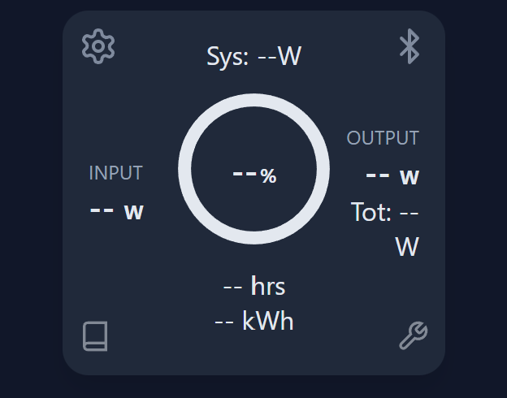
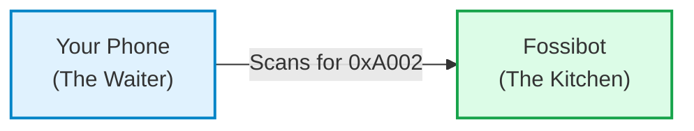
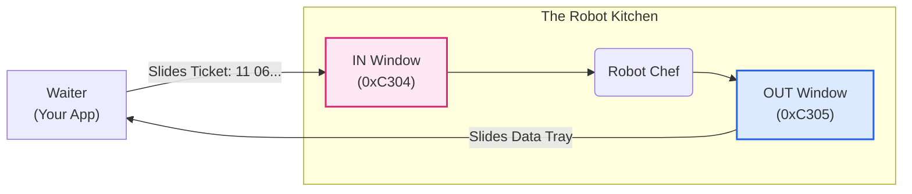
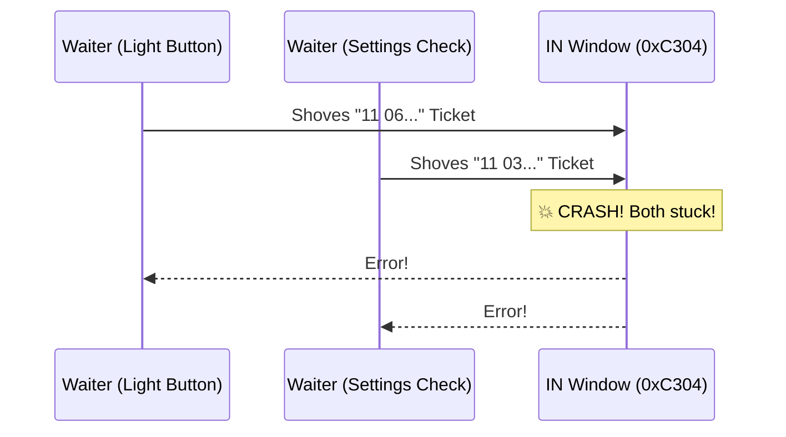
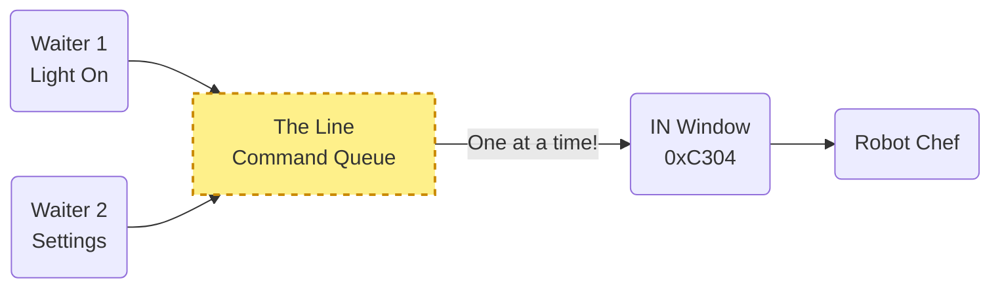

# Fossibot / AFERIY / SYDPOWER  Control PWA

**Unlock the full potential of your portable power station.**

This Progressive Web App (PWA) allows you to control and monitor your Fossibot F2400, F3600 Pro, and similar power stations directly from your browser via Bluetooth Low Energy (BLE). It bypasses the need for the official cloud-dependent app, offering a private, offline-first, and feature-rich alternative. This has only been fully tested on a Fossibot anf Afirty but should work on SYDPOWER and ABOK. Below is a list of Makes and Models it should work. I created this Web App with the help of Antigravity using Gemini Pro 3 and Claude Opus. I was fed up with the BrightEMS app logging me out all the time and if I was somewhere without Internet I wouldn't be able to easily control it or see the stats. Good luck. **On the app, please go into diagnostics and click Copy JSON, and paste it into the Github Repo Issues, I'm interested in see other users diagnostic data to work out some extra mappings. User interface bottom right on the stats page takes you to diag.**

FOSSiBOT F3600 Pro, FOSSiBOT F2400
SYDPOWER N052, SYDPOWER N066
AFERIY P210, AFERIY P310
ABOK Power Ark3600 (Probalby works, but not tested)

**🚀 [Launch Web App](https://dandwhelan.github.io/fossibot-bluetooth/)**

### 📱 Interface Guide

| Area | Icon / Label | Function |
| :--- | :--- | :--- |
| **Top Bar** | **Not connected / Connected** | **Connection status:** Always shows whether you are connected, and to which power station. Tap it to connect or disconnect. |
| **Top Left** | ⚙️ (Gear) | **Settings:** Open configuration menu (Charge limits, Timers, Theme). |
| **Top Right** | ⚡ (Bluetooth) | **Connect/Disconnect:** Toggle connection to the device. |
| **Center** | **Ring Chart** | **Battery Level:** Visual and percentage SOC. Color changes with level. |
| **Center** | **-- W** | **Power Flow:** Input (Left) and Output (Right) wattage. |
| **Bottom** | **-- hrs** | **Time Remaining:** Shows "Time to Empty" 🔋 or "Time to Full" ⚡ while charging. |
| **Bottom Left** | 📖 (Book) | **Device Info:** System Summary and status flags. |
| **Bottom Right** | 🔧 (Wrench) | **Diagnostics:** Advanced debugging, register inspector, and JSON import/export. |

## ✨ Comprehensive Features

### ⚡ Real-Time Telemetry & Monitoring
*   **Switchable Dashboard Layouts:** Pick the dashboard that suits you in Settings → Theme & Layout: **Classic**, **Energy Flow** (animated power-flow diagram with tappable output nodes), **Gauges** (cockpit-style radial dials), or **Pro Monitor** (data-dense table with a full-size chart on top).
*   **Smart Time Estimates:** Automatically switches between **"Time to Full"** (⚡) when charging and **"Time to Empty"** (🔋) when discharging.
*   **Live Power Flow:** Visualize real-time Input (Charging) and Output (Discharging) wattage with dynamic gauges.
*   **System Health & Active Fan Monitoring:** Monitor system voltage, frequency, and real-time active cooling fan speed levels (`0`–`5`) with an animated spinning fan indicator on the dashboard whenever fans are active.
*   **Flashing Visual Fault Alerts:** Prominent pulsing red/amber fault warning banner that immediately flashes in the UI when an issue occurs on the device (Error 78 Inverter Trip, Error 79 Critical Hardware Safety Lockout, or Thermal Extreme Protection).
*   **Thermal Protection Detection:** Decodes internal environmental protection states: sub-zero cold freeze charging lockout (&lt;0°C via Reg 21 code 15) and high-heat inverter safety pause (&gt;55°C via Reg 8 code 79 with Reg 42 hardware mask = 0).
*   **Battery Extensions:** Support for monitoring external battery packs (Success/Extension batteries) with individual charge levels.
*   **Power History Chart:** Live graph of Input/Output wattage and battery % on the dashboard, with optional Fan level and AC input voltage series when active. Selectable time ranges (5m / 10m / 30m / 1h / 24h), tap the graph to read exact values at any point, and one-click **CSV export**.
*   **Persistent History:** Chart samples are stored locally (IndexedDB) so the last 24 hours survive page reloads and reconnects.
*   **Daily Energy Totals:** Charged/discharged energy (Wh / kWh) is tracked per day under the chart, with an optional cost estimate if you enter your electricity tariff in Settings → App Data.
*   **Session Stats:** Average and peak output plus peak input for the current connection, shown under the chart.
*   **OLED Saver Theme:** Pure-black theme that switches OLED pixels off — the most power-efficient way to leave the dashboard on overnight with "Keep Screen Awake".
*   **Saved Devices & One-Tap Reconnect:** Devices you have paired once appear in Settings → My Devices — reconnect without the browser chooser, rename or forget them, and optionally auto-connect when the app opens (Chrome/Edge).
*   **Guided First Connection:** A status bar at the top of the dashboard always says whether you are connected and to what. Until you are, the dashboard is replaced by a short walkthrough — switch the station on, turn Bluetooth on, tap Connect — and after the first pairing that becomes a single **Connect to \<your station\>** button. Failures are explained in plain English with the next thing to try, instead of leaving the screen full of dashes.
*   **Auto-Reconnect:** Automatically retries the Bluetooth connection (with backoff) if the link drops unexpectedly.
*   **Keep Screen Awake:** Optional Wake Lock so your phone screen stays on while monitoring.
*   **Alerts:** Optional browser notifications for low battery (configurable threshold), device faults, charge complete, AC input loss (UPS use), and output overload.
*   **Adjustable Poll Rate:** Choose how often the app reads device status (1–10 s).
*   **Settings Backup:** Export/import all app preferences (themes, alerts, custom appliances, energy totals) as JSON from Settings → App Data.

### 🔋 Power Simulator
*   **Runtime Calculator:** Estimate how long your power station will run with selected appliances.
*   **Split AC/DC Lists:** Clearly organized appliance management with separate AC and DC columns.
*   **Editable Wattages:** Click any appliance wattage to customize its power draw.
*   **Efficiency Modeling:** Card-based AC (88%) and DC (96%) efficiency toggles to account for real-world conversion losses.
*   **Custom Appliances:** Add your own devices with custom names, wattages, and AC/DC type — saved across sessions and removable.

### 🛠️ Advanced Control Dashboard
*   **Power Toggle:** Remotely toggle AC Inverter, DC (12V) Output, and USB Ports.
*   **LED Light Control:** Switch between Light modes: **Off**, **Low**, **High**, **SOS**, and **Flash**.
*   **Silent Charging Mode:** Toggle "Silent Charging" to reduce fan noise max charging speed for overnight use.

### 🤖 SwitchBot Power Button (Remote Power-On)
*   **Wake a powered-off station:** When the station is off its Bluetooth is off too, so no app can switch it on remotely. Stick a [SwitchBot Bot](https://us.switch-bot.com/products/switchbot-bot-rechargeable) (button-pusher) over the physical power button and the **Press** button at the bottom of the dashboard makes it press the button for you.
*   **One-tap pairing:** The first tap opens the browser's Bluetooth chooser filtered to SwitchBot devices (the Bot usually advertises as "WoHand"; on Android and Windows the chooser also shows the MAC address so you can pick the right one). Browsers cannot pre-select a device by MAC address, so this first pick is always manual — after that the Bot is remembered and Press fires immediately.
*   **Password support:** If the Bot has a password set in the SwitchBot app you are asked for it once; only the CRC32 checksum the protocol needs is stored locally, never the password itself.
*   **Hands-free recovery:** After a successful press the app waits 5 seconds for the station to boot, then starts the normal auto-connect so the dashboard comes straight back up.
*   Works with the original Bot and the 2026 rechargeable USB-C Bot — both speak the same BLE protocol.

### ⚙️ Power Management Settings (F2400 / Classic V0 Platform)
The web application is tailored for the **Classic V0 Platform** (Fossibot F2400, F3600 Pro, Aferiy P210/P310, SYDPOWER N052/N066) communicating via Modbus BLE (0x1103 Settings / 0x1104 Status):
*   **Platform Identifier Badge:** Active profile banner clearly identifying the Classic V0 Modbus protocol.
*   **Key Sound / Buzzer Tone:** Remotely toggle button confirmation beep (Reg 56).
*   **AC Output Frequency:** Switch inverter output between **50 Hz and 60 Hz** (Reg 16: 500 = 50Hz, 600 = 60Hz).
*   **Charging Rate:** Adjust AC Charging power from **300W to 1100W+** across 5 selectable levels (Reg 13).
*   **Max Charging Current:** Select maximum charging current ceiling in Amps (Reg 20, 3A–20A).
*   **Discharge Limit:** Set a lower DOD limit for battery discharge (e.g., stop discharging at 10%) to preserve battery health (Reg 66).
*   **EPS / UPS Settings:** Configure Entry Power Supply (UPS mode) behavior and upper charge limits (Reg 67: 60%–100%).
*   **Schedule Charge Delay:** Schedule charge start countdown in minutes (Reg 63 write, Reg 57 live countdown, and one-click cancel).
*   **Hardware & Sub-MCU Firmware Inspector:** Real-time decoding of AC Inverter, BMS, Solar MPPT, and Front Display Panel MCU firmware versions (Regs 47–50), maximum AC wattage ceiling (Reg 14), and regional hardware model IDs (Reg 11).
*   **Standby Timers:** detailed control over auto-shutdown timers to save power:
    *   **Screen Timeout:** (Reg 62) 1 min, 3 min, 5 min, 10 min, 30 min, 1 hr, 2 hr, 4 hr, Never.
    *   **System Idle Shutdown (Whole Device):** Auto-shutdown the entire device after inactivity (Reg 68: 5 min – 8 hr). ⚠️ **"Never" / 0 is not supported and has been confirmed to permanently brick devices** — the option is removed and writes of 0 to register 68 are blocked at the protocol layer.
    *   **AC Standby:** Turn off inverter if no load detected (Reg 60: 1 hr, 8 hr, 16 hr, 24 hr, Never).
    *   **DC Standby:** Turn off 12V DC ports if idle (Reg 61: 1 hr, 8 hr, 16 hr, 24 hr, Never).
    *   **USB Standby:** Turn off USB ports if idle (Reg 59: 5 min, 10 min, 30 min, 1 hr, 2 hr, 8 hr, 10 hr, Never).
*   **Factory Reset / Unbind:** Safely reset station parameters to defaults and unbind via Reg 0 with confirmation dialog.

### 🔍 Advanced Diagnostics & Reverse Engineering
*   **Auto-Refresh:** Live status updates every 2-10 seconds for real-time debugging.
*   **Multi-Device Comparison:** Import JSON diagnostic files from other users to compare specifications, firmware settings, and calibration data side-by-side.
*   **Change Recorder:** Capture a baseline and automatically detect register changes after performing physical actions on the device (reverse engineering helper).
*   **Register Inspector:** View raw BMS data streams (0x1104 Status vs 0x1103 Settings).
*   **Safety Status Card & Fault Matrix:** Real-time health banner showing active safety states and complete reference table for Error Codes 78, 79, 136, hardware fault masks, and DC-DC protection flags.
*   **System Summary:** Get a plain-English status report of the device state.
*   **Visualization:** "Flash" indicators show exactly which data points are changing in real-time.
*   **Hide Zeros:** Filter out unused registers to focus on active data.

### 🎨 Customization & Themes
Personalize your control panel with built-in themes:
*   ☢️ **Pipboy:** Fallout-inspired retro CRT green.
*   🏭 **Industrial:** Clean, high-contrast, professional amber/slate look.
*   🌃 **Cyberpunk:** Neon magenta and cyan on dark purple.
*   🌊 **Ocean:** Calming teal and deep blue tones. (Default)
*   🌅 **Sunset:** Warm gradients of violet, orange, and gold.
*   ☀️ **Daylight:** Pleasant light mode with soft whites and muted blues.
*   🖥️ **Terminal:** Minimalist retro command prompt style.
*   🌈 **Rainbow:** High-visibility vibrant colors.

---

## 📱 detailed Installation Guide

This app uses **Web Bluetooth API**, which means it runs entirely in your browser but can talk to hardware devices.

### Platform Support

| Platform | Browser | Status | Notes |
| :--- | :--- | :--- | :--- |
| **Android** | Chrome / Edge | ✅ Fully Supported | Best experience. Supports PWA install. |
| **Windows / Mac / Linux** | Chrome / Edge | ✅ Fully Supported | Requires Bluetooth hardware on PC. |
| **iOS / iPadOS** | **Bluefy** Browser | ⚠️ Restricted | Safari does NOT support Web Bluetooth. You must download [Bluefy](https://apps.apple.com/us/app/bluefy-web-ble-browser/id1492822055) from the App Store. |

### How to Install (PWA)
For the best experience (fullscreen, offline access), install the app:

1.  **Open the App:** Navigate to [dandwhelan.github.io/fossibot-bluetooth/](https://dandwhelan.github.io/fossibot-bluetooth/)
2.  **Pair:** Click the blue **Connect** button top-right. Select your device (usually named "Fossibot..." or similar) from the list.
3.  **Install:**
    *   **Chrome (Desktop):** Click the "Install" icon in the address bar (right side).
    *   **Chrome (Android):** Tap the menu (⋮) -> "Add to Home Screen" or "Install App".
    *   **Bluefy (iOS):** Bookmark the page.

---

## 🔄 Battery Factory Reset

If you want to remove your battery's Wi-Fi connection to the cloud (or recover
after sending bogus credentials with the "Disable WiFi Access Point" button),
you can factory-reset the battery. Press and hold the **DC**, **Light**, and
**USB** buttons simultaneously for about 5 seconds. You will hear a beep when
the reset completes.

---

## 🔧 Technical Protocol Documentation

For developers interested in the underlying communications or building their own integrations (Home Assistant, ESP32, etc.).

### Bluetooth Service UUIDs
*   **Main Service:** `0000a002-0000-1000-8000-00805f9b34fb`
*   **Write Characteristic:** `0000c304-0000-1000-8000-00805f9b34fb` (Send commands)
*   **Notify Characteristic:** `0000c305-0000-1000-8000-00805f9b34fb` (Receive data)

### Data Packets
The device uses a custom binary protocol wrapped in BLE GATT.

#### 1. Status Packet (`0x1104`)
Received automatically via Notify (UUID `...C305`). Contains read-only telemetry.
*   **Structure:** `[Header 0x11 0x04] [Data ~170b] [CRC]` or simply raw Modbus-like register dump.
*   **Key Registers:**
    *   `Reg 20`: Total Output Watts
    *   `Reg 21`: System Idle Load (~10W units)
    *   `Reg 56`: Main Battery SOC (0-1000, scale 10)
    *   `Reg 58`: Time to Full (minutes)
    *   `Reg 59`: Time to Empty (minutes)

#### 2. Settings Packet (`0x1103`)
Received upon request or when settings change.
*   **Key Registers:**
    *   `Reg 13`: Charge Power Level
    *   `Reg 27`: LED Light State
    *   `Reg 57`: Silent Charging Toggle

### Writing Commands
Commands are sent to the Write Characteristic using a specific structure:
`[Header 0x11] [Cmd 0x??] [Reg High] [Reg Low] [Val High] [Val Low] [CRC]`

**See [PROTOCOL.md](PROTOCOL.md) for the complete reverse-engineered register map and packet structure details.**

---

### ☀️ Next-Gen V1 Platform & Balcony Solar Findings

APK reverse-engineering of the manufacturer app revealed that newer hardware revisions and Balcony Solar products utilize a modernized protocol dubbed **V1 Platform** (`portable-power-station-v1`, `balcony-pv`, and `switch-box` device families, internally identified by `protocol_version >= 1` and the unified `se` register architecture):

*   **Unified Register Layout (`se`):** Rather than scattering configuration across arbitrary high-numbered registers, the V1 platform condenses standby and power limits into lower contiguous holding registers:
    *   `Reg 24`: AC Inverter Standby Sleep Timer (replaces V0 Reg 60)
    *   `Reg 25`: LCD Screen Dim Timer (replaces V0 Reg 62)
    *   `Reg 26`: Minimum Discharge Limit (DOD %) (replaces V0 Reg 66)
    *   `Reg 27`: UPS Maximum Charge SOC Limit (%) (replaces V0 Reg 67)
    *   `Reg 28`: Whole Machine Auto-Shutdown Timer (replaces V0 Reg 68)
    *   `Reg 29`: USB / QC / PD Sleep Timer (replaces V0 Reg 59)
    *   `Reg 30`: 12V DC Port Sleep Timer (replaces V0 Reg 61)
    *   `Reg 86`: Grid-Tie Export / Feedback Power Maximum (Watts)
*   **System State Bitmask (OpCode `0x05` / Reg 75):** Rapid single-packet toggling of 15 system states via bitfield flags:
    *   `Bit 0`: Solar Self-Consumption Mode
    *   `Bit 1`: Grid Feedback Pause
    *   `Bit 3`: AI Dynamic Energy Scheduling
    *   `Bit 6`: Silent Charging Mode
    *   `Bit 7`: Buzzer / Key Sound Enable
    *   `Bit 9`: Low-Voltage Solar PV Charge Enable
    *   `Bit 10`: Car Charging Enable
    *   `Bit 11`: Master DC / USB / LED / Wireless Power Enable
    *   `Bit 13`: High-Voltage Solar PV Charge Enable
    *   `Bit 14`: Remote App Shutdown
*   **Balcony Solar & Energy Metering:**
    *   32-bit Lifetime Solar Generation Wh counters (Reg 59 High Word, Reg 60 Low Word) and Daily Solar Wh (Reg 61).
    *   Built-in RTC synchronization (Regs 97–99: Year/Month, Day/Hour, Minute/Second).
    *   Micro-inverter grid feed-in coordination, smart socket integration, and grid export power limits.

*Note: While the web app is optimized for the widely-deployed Classic V0 platform (F2400, F3600 Pro, Aferiy P210/P310), the complete V1 register definitions are fully mapped in [PROTOCOL.md Section 9](PROTOCOL.md#9-next-gen-platform-protocol-v1--balcony-solar--unified-architecture) for developers building Next-Gen drivers.*

---

### 🚐 DC-DC Auxiliary Battery Charger Protocol (`wp`)

The manufacturer codebase also contains driver support for dual-battery vehicle/camper DC-DC chargers (`DC_DC-V1-0083` profile, `wp` register architecture):
*   **Live Alternator Telemetry (0x1104):** Alternator input voltage, current, and wattage (`Regs 0–2`), auxiliary battery charge voltage, current, and wattage (`Regs 3–5`), and heatsink temperature (`Reg 6`).
*   **Engine Protection:** Hardware engine flameout detection and vibration cut-off protection (`Reg 7 Bit 7` / `Reg 13`), and alternator cutoff voltage threshold (`Reg 14`).
*   **Target Float / Bulk Voltage Setting:** Adjustable auxiliary battery charge voltage profile (`Reg 11`).

*See [PROTOCOL.md Section 10](PROTOCOL.md#10-dc-dc-auxiliary-battery-charger-protocol) for complete register tables.*

---

### ⚡ Smart Automatic Transfer Switch Box (`switch-box` / ATS)

The manufacturer ecosystem includes an automated transfer switch box (`switch-box`) for whole-home backup, RV sub-panel switching, and dynamic off-grid scheduling:
*   **Operational Mode (Input Reg 4):** Switches between `1 = Mains Mode` (grid priority pass-through) and `2 = Smart Mode` (dynamic automated off-grid scheduling).
*   **Grid Transfer Status (Input Reg 12):** Live state reporting `1 = ON GRID` (mains active), `2 = OFF GRID` (sub-panel isolated and powered by the portable power station), or `3 = FAULT`.
*   **Forced Off-Grid Control (Holding Reg 12):** Remotely force the relay to disconnect from the electrical utility grid and run 100% off the portable power station battery.

*See [PROTOCOL.md Section 13](PROTOCOL.md#13-smart-transfer-switch-box-switch-box--automatic-transfer-switch-ats) for full protocol details.*

---

## 🤝 Contributing & Development

This project is open-source and depends on community investigation to map unknown registers for different models.

1.  **Clone the Repo:** `git clone https://github.com/dandwhelan/fossibot-bluetooth.git`
2.  **Run Locally:** Use a local server (e.g. VS Code Live Server) to serve `index.html` over HTTPS (or localhost). **Note:** Web Bluetooth requires a Secure Context (HTTPS or localhost).
3.  **Investigate:** Use the built-in Diagnostics tab to find new registers.
4.  **Submit PR:** Pull Requests are welcome! I've love people to find out what all the other settings and options do.

## 📄 License

MIT License. Free for personal and commercial use.

---

## 🧒 Explain it like I'm 5 years old

Here is how the Bluetooth data works in this app, using a **Robot Restaurant** analogy.

### The Magic Bluetooth Restaurant 🍔🤖

Imagine the **Fossibot** is a very busy **Robot Chef** inside a magical kitchen. Your **Phone** is the **Waiter**. 

### 1. Finding the Restaurant (The Connection)

Before anything can happen, the Waiter (your phone) needs to find the right restaurant.

*   **The World:** There are thousands of buildings (Bluetooth devices) nearby.
*   **The Address (`0xA002`):** The Waiter has a specific address written on a piece of paper. He ignores the Library and the Gym and goes straight to **"Chef Bot's Kitchen (Address 0xA002)"**.

```mermaid
graph LR
    Phone["Your Phone<br>(The Waiter)"] -- Scans for 0xA002 --> Device["Fossibot<br>(The Kitchen)"]
    style Phone fill:#e0f2fe,stroke:#0284c7,stroke-width:2px
    style Device fill:#dcfce7,stroke:#16a34a,stroke-width:2px
```

### 2. The Serving Windows (Characteristics)

Once inside, the Waiter sees the Chef. But he can't just shout orders! There are two special windows to pass things through.

#### Window A: The "Order Here" Window (`0xC304`)
*   **What it is:** The **IN** window. Think of `0xC304` as the **Mailbox Number** painted on the wall.
*   **The Ticket:** The command `11 06...` is the **Letter** you put inside.
    *   *Note:* You don't write "0xC304" on the letter itself. You just put the letter *into* the box marked "0xC304".
*   **The Secret Language:** The Waiter writes: `11 06 00 1B 00 01` ("Reg 27 On").

#### Window B: The "Pick Up" Window (`0xC305`)
*   **What it is:** The **OUT** window.
*   **How it works:** The Waiter stands here and waits. Every few seconds, the Chef slides a tray of food (Data) out.

```mermaid
graph LR
    Waiter["Waiter<br>(Your App)"] -- "Slides Ticket: 11 06..." --> WindowA["IN Window<br>(0xC304)"]
    WindowB["OUT Window<br>(0xC305)"] -- Slides Data Tray --> Waiter
    subgraph Kitchen [The Robot Kitchen]
        WindowA --> Chef(Robot Chef)
        Chef --> WindowB
    end
    style WindowA fill:#fce7f3,stroke:#db2777,stroke-width:2px
    style WindowB fill:#dbeafe,stroke:#2563eb,stroke-width:2px
```

### 3. The Problem: The Kitchen Traffic Jam 🚦💥

Before we fixed the code, here is what was happening:

1.  You pressed "Turn On Light" (`11 06...`). The Waiter ran to the **IN Window**.
2.  At the *exact same time*, the App wanted to ask "What is the Settings?" (`11 03...`). A second Waiter ran to the **IN Window**.
3.  **Use your imagination:** Two waiters tried to shove two order tickets through the tiny slot at the exact same moment!
4.  **The Result:** They bumped heads. The tickets fell on the floor. The Chef got confused and yelled **"GATT ERROR!"** (which is robot for "Get Out!").

```mermaid
sequenceDiagram
    participant Waiter1 as Waiter (Light Button)
    participant Waiter2 as Waiter (Settings Check)
    participant Slot as IN Window (0xC304)
    
    Waiter1->>Slot: Shoves "11 06..." Ticket
    Waiter2->>Slot: Shoves "11 03..." Ticket
    Note over Slot: 💥 CRASH! Both stuck!
    Slot-->>Waiter1: Error!
    Slot-->>Waiter2: Error!
```

### 4. The Solution: The Ticket Line (Command Queue) 🎫🚶‍♂️🚶‍♀️

We built a nice velvet rope line (a **Queue**) in front of the **IN Window**.

1.  **Waiter 1** arrives with "Turn On Light". The rope creates a barrier. He goes first.
2.  **Waiter 2** arrives with "Get Settings". He sees Waiter 1 is busy, so he **waits in line**.
3.  Waiter 1 slides his ticket (`11 06...`). Success! ✅
4.  Waiter 1 leaves. The Chef takes a breath (**500 milliseconds**).
5.  **Waiter 2** steps up and slides his ticket (`11 03...`). Success! ✅

Now, everyone gets their turn, the Chef is happy, and the "GATT Error" is gone forever!

```mermaid
graph LR
    W1(Waiter 1<br>Light On)
    W2(Waiter 2<br>Settings)
    Queue[The Line<br>Command Queue]
    Slot(IN Window<br>0xC304)
    Chef(Robot Chef)

    W1 --> Queue
    W2 --> Queue
    Queue -- One at a time! --> Slot
    Slot --> Chef

    style Queue fill:#fef08a,stroke:#ca8a04,stroke-width:2px,stroke-dasharray: 5 5
```

